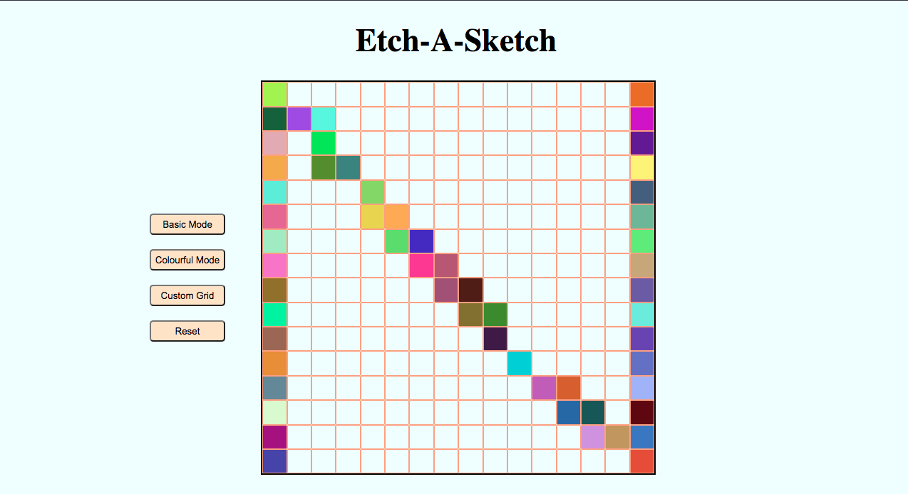

# Etch-A-Sketch
> Etch-a-Sketch is a project to recreate a Paint software.
> Live demo [_here_](https://nabelk.github.io/Etch-A-Sketch/). 

## Table of Contents
* [General Info](#general-information)
* [Technologies Used](#technologies-used)
* [Features](#features)
* [Screenshots](#screenshots)
* [Room for Improvement](#room-for-improvement)
* [Acknowledgements](#acknowledgements)
* [Contact](#contact)

## General Information
- Etch-a-Sketch is a part of The Odin Project:Foundations course. 
- This project is when a user move their mouse to the choosen grid, it will trigger a colour change of the grid.
- By creating this project, I learned a lot the use of DOM to manipulate HTML elements and CSS syling.

## Technologies Used
- HTML
- CSS
- Javascript & Vanilla js

## Features
List the ready features here:
- Custom grid, colourful mode and reset button.

## Screenshots

## Room for Improvement
Room for improvement:
- A better UX like when a user can click and drag on the grid to trigger change of the colour.
- More features like any other sketch software.

## Contact
Created by [@nabelk](https://www.linkedin.com/in/nabil-khalid-36791a241/) - feel free to contact me!